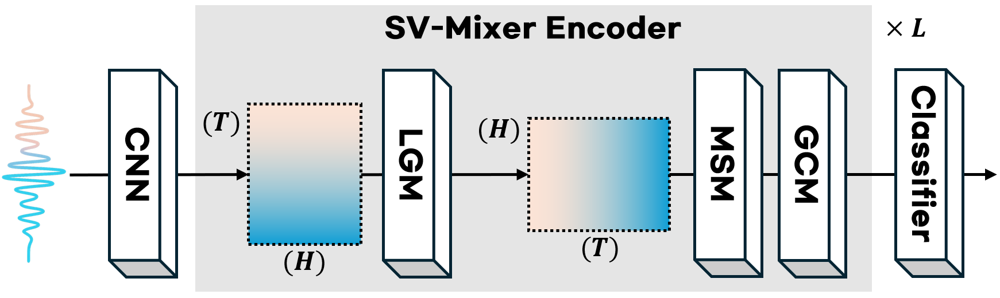

# SV-Mixer: MLP-based Transformer Alternative Architecture for Self-Supervised Model Compression in Speaker Verification

> [📄 Paper: *SV-Mixer: Replacing the Transformer Encoder with Lightweight MLPs for Self-Supervised Model Compression in Speaker Verification*](./assets/paper.pdf)  
> 📅 Conference: IEEE ASRU 2025 (Under Review)

---

## 🔍 Overview

**SV-Mixer** is a novel, attention-free encoder architecture designed to replace Transformer-based encoders in self-supervised model compresson for speaker verification tasks. Unlike previous student models that retain self-attention, SV-Mixer uses purely MLP-based modules optimized for temporal and spectral modeling — reducing computation while preserving accuracy.

---

## 🧠 Key Contributions

- **Transformer-Free Design**: SV-Mixer replaces the Transformer with three MLP-based modules:
  - **Local-Global Mixing (LGM)**: Captures both frame-level and utterance-level context.
  - **Multi-Scale Mixing (MSM)**: Handles speech dynamics over multiple temporal resolutions.
  - **Group Channel Mixing (GCM)**: Models frequency subspaces efficiently.

- **Model Compression**: Achieves over **55% fewer parameters** and **49.6% less compute per layer**, yet matches or exceeds the performance of Transformer-based students.

- **Distillation Compatibility**: Effectively distilled from large SSL models (WavLM, HuBERT, wav2vec 2.0), even though SV-Mixer is structurally dissimilar.

---

## 🏗️ Architecture

The SV-Mixer pipeline consists of:

1. **1D Convolutional Frontend** (7 layers, same as teacher)
2. **SV-Mixer Encoder Blocks**
3. **Backend Classifier** (e.g., ECAPA-TDNN)

Each encoder block integrates:

- LGM → MSM → GCM  
This sequential flow enables strong generalization under compression.



---

## 📊 Experimental Results

| Model        | Params/Layer | GMACs/Layer | Vox1-O EER | VoxSRC23 EER |
|--------------|---------------|--------------|------------|---------------|
| Transformer  | 8.40M         | 1.25         | 1.78%      | 7.80%         |
| SV-Mixer     | 3.75M         | 0.63         | **1.52%**  | **6.61%**     |

SV-Mixer also outperforms:

- MLP-Mixer (by 16.5%)
- CycleMLP (by 19.6%)
- ConvMixer (by 11.6%)

---

## ⚙️ Setup (Optional)

### 🐳 Docker (Recommended)

This project is designed to run inside a Docker container.

- The [`Dockerfile`](./assets/setup/Dockerfile) defines the full environment with CUDA and PyTorch support.
- Use the provided shell scripts ([`build.sh`](./assets/setup/build.sh), [`launch.sh`](./assets/setup/launch.sh)) to build and launch the container:

⚠️ **Important:** You **must** edit `{PATH_Dockerfile}` in [`build.sh`](./assets/setup/build.sh) before running.

```bash
# Build Docker image
./build.sh

# Launch container
./launch.sh
```

### 🛠 Manual Installation

For users who prefer **not to use Docker**, two options are provided:

- [`requirements.txt`](./assets/setup/requirements.txt): full environment with all dependencies (recommended for development and training)
- [`cleaned_requirements.txt`](./assets/setup/cleaned_requirements.txt): minimal environment for inference or lightweight usage

Install either one using:

```bash
# Full environment
pip install -r assets/setup/requirements.txt

# OR: Minimal setup
pip install -r assets/setup/cleaned_requirements.txt
```

## 🔧 Usage

This project supports three typical use cases:

### Option 1: Train & Evaluate (Full Pipeline)

Train a SV-Mixer model from scratch using WavLM knowledge distillation, and evaluate it on VoxCeleb1-O datasets. 

➝ Go to [`📁experiments/train_eval/`](./experiments/train_eval/README.md)

### Option 2: In-Depth Evaluation (No Training)

Run detailed evaluations on multiple datasets (VoxCeleb-Hard, VC-Mix, VOiCES, ...) using a **pretrained model**.

➝ Go to [`📁experiments/eval_only/`](./experiments/eval_only/README.md)

### Option 3: Inference-Only Mode (Using Only Speaker Embeddings)

Use this option if you only need a **pretrained speaker verification model** for downstream tasks or further research — no training or evaluation setup required.  
This mode processes all `.wav` files in a `{target_directory}`, extracts speaker embeddings using the pretrained model, and saves them with matching filenames.

➝ Go to [`📁experiments/inference/`](./experiments/inference/README.md)

### ▶ How to Run (Common to All Modes)

1. Open the `arguments.py` file in the selected mode's directory.
→ Edit only the `FIXME` fields to match your environment (e.g., dataset paths, checkpoint locations).

2. Run the entry script:

```bash
python main.py
```

## 📎 Citation

```bash
@article{svmixer2025,
  title     = {SV-Mixer: Replacing the Transformer Encoder with Lightweight MLPs for Self-Supervised Model Compression in Speaker Verification},
  author    = {anonymous},
  journal   = {IEEE ASRU},
  year      = {2025},
  note      = {Under Review}
}
```

## 🛡️ License

This project is licensed under the MIT License – see the LICENSE file for details.
